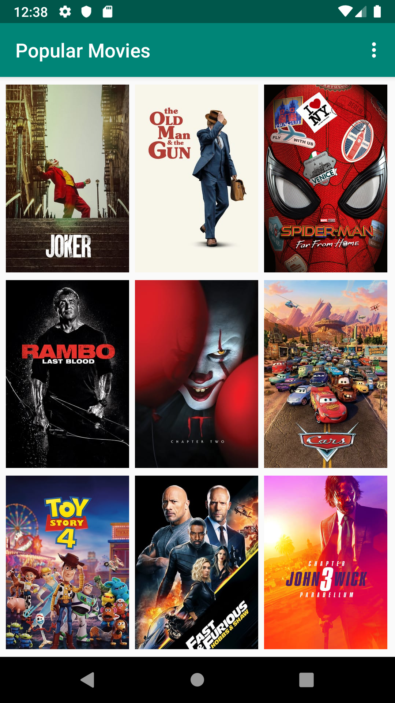
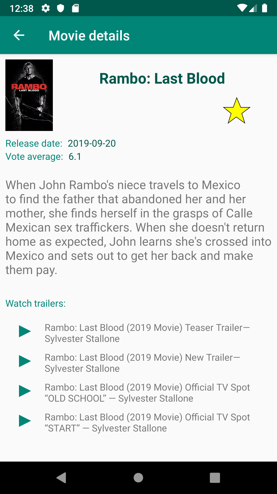

# Popular Movies Project (stage2)

## API KEY info

The project uses The Movie Database API and needs a proper API KEY. 

You can request your own key from TMDb, see: https://www.themoviedb.org/faq/api

Insert the key into gradle.properties file or directly in app settings (app settings takes precedence).
To access app settings run the app and touch the icon in the upper right corner of the device screen ("hamburger menu").

## Project Overview

The **Popular Movies** app allows users to discover the most popular movies now playing. The app presents movie posters upon launch. User can change sort order via a setting. The sort order can be by most popular or by highest-rated. Tapping on a movie poster opens a details screen with additional information such as: original title, movie poster image thumbnail, a plot synopsis, user rating, release date, trailers and userd reviews of a selected movie. Each movie can be marked as favorite in the details view by tapping a star button.

The project is part of the Udacity course: **Android Developer Nanodegree Program**.

## Why this Project

The app includes the foundational elements of programming for Android. It communicates with the Internet and provide a responsive and delightful user experience. App uses Android Architecture Components (Room, LiveData, ViewModel and Lifecycle) to create a robust an efficient application.

## Project requirements
- UI contains an element (e.g., a spinner or settings menu) to toggle the sort order of the movies by: most popular, highest rated.
- Movies are displayed in the main layout via a grid of their corresponding movie poster thumbnails.
- UI contains a screen for displaying the details for a selected movie.
- Movie Details layout contains title, release date, movie poster, vote average, plot synopsis, section for displaying trailer videos and user reviews.
- When a user changes the sort criteria (most popular, highest rated, and favorites) the main view gets updated correctly.
- When a movie poster thumbnail is selected, the movie details screen is launched.
- When a trailer is selected, app uses an Intent to launch the trailer.
- In the movies detail screen, a user can tap a button (for example, a star) to mark it as a Favorite. Tap the button on a favorite movie will unfavorite it.
- In a background thread, app queries the /movie/popular or /movie/top_rated API for the sort criteria specified in the settings menu.
- App requests for related videos for a selected movie via the /movie/{id}/videos endpoint in a background thread and displays those details when the user selects a movie.
- App requests for user reviews for a selected movie via the /movie/{id}/reviews endpoint in a background thread and displays those details when the user selects a movie.
- The titles and IDs of the user’s favorite movies are stored using Room and are updated whenever the user favorites or unfavorites a movie. No other persistence libraries are used.
- When the "favorites" setting option is selected, the main view displays the entire favorites collection based on movie ids stored in the database.
- Database is implemented using Room. No other persistence libraries are used.
- Database is not re-queried unnecessarily. LiveData is used to observe changes in the database and update the UI accordingly.
- Database is not re-queried unnecessarily after rotation. Cached LiveData from ViewModel is used instead.

## Screenshots

 &nbsp;&nbsp; 

